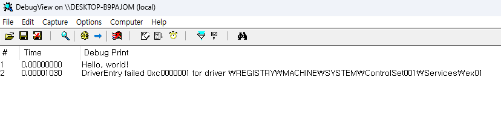

# Exercise 01: Hello, World!

## Description

Print the string "Hello, world!". That's it!

## Demonstration

```
# sc create ex01 binpath= "%USERPROFILE%\Desktop\hello_world.sys" displayname= "ex01" start= demand type= kernel
[SC] CreateService SUCCESS

# sc start ex01
[SC] StartService FAILED 31
A device attached to the system is not functioning.
```

Register a new service and then start.



You can see "Hello, world!" in the DbgView. We don't need to keep loading a sample driver in memory, that's why the DriverEntry function returned `STATUS_UNSUCCESSFUL`. So DriverEntry failure is a intended result.