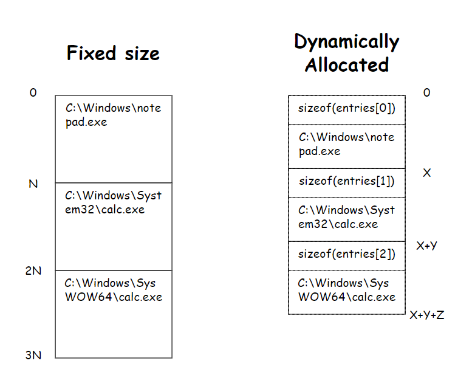
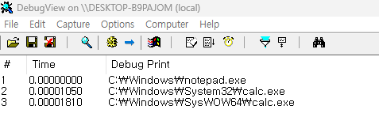

# Exercise 02: Register My Own Process Blacklist - Part 1

## Description

In an user application, there are multiple options to communicate with a kernel driver, system call, communication port, and I/O request. But the system call is not for us, the system. Also the communication port can used by a minifilter driver only. So in this case, we will communicate to our sample driver using I/O request.

The following image describes the flow of an I/O request.


If an user application calls `DeviceIoControl`, I/O Manager builds an IRP(I/O Request Packet) which is `IRP_MJ_DEVICE_CONTROL`. The IRP sent to the top driver in driver stack. If the IRP is not complete in the driver, it sends to the next lower driver. If IRP has completed, it sent in reverse order.



When we send the list of process image path, we will use a bit efficient data structure, dynamically allocated array. It is opposite to the fixed size array. The dynamically allocated array uses only the size of each entry, while fixed size array has limitation of size and waste bunch of bytes every entry. But, there are not only good things. Fixed size array is easy to use, but dynamically allocated array is tricky and it occurs a mistake often. The `FIELD_OFFSET` macro will help you to prevent these disadvantage.

You don't need to do with a specific data structure. This is just an exercise, you can try whatever you go.

## Demonstration

```
# sc create ex02 binpath= "%USERPROFILE%\Desktop\sys.sys" start= demand type= kernel
```
```
# sc start ex02
```

Register a new service and then start.



The driver prints the list of process image path. It means an user application sends the list to our driver successfully.